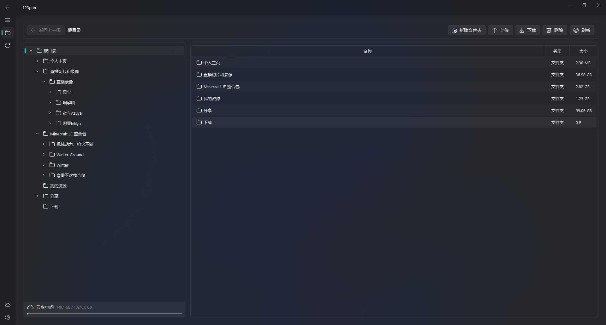

<div align="center">

# 🚀 [123pan](https://www.123panng.top)

  <p>突破限制 · 高效下载 · 简单易用</p>
  
  <div>
    <a href="https://github.com/123pannextgen/123pan/stargazers"></a>
    <a href="https://github.com/123pannextgen/123pan/issues"></a>
    <a href="https://github.com/123pannextgen/123pan/blob/main/LICENSE"></a>
    <a href="https://www.python.org/downloads/"></a>
    <a href="https://github.com/123pannextgen/123pan/releases"></a>
    <a href="https://github.com/123pannextgen/123pan/releases"></a>
  </div>
  <br>
  

</div>

## 介绍

123pan是一款基于Python开发的高效下载辅助工具，通过模拟安卓客户端协议，帮助用户绕过123云盘的自用下载流量限制，实现无阻碍下载体验。

## 项目源码结构

```
123pan/
├── CODE_OF_CONDUCT.md
├── CONTRIBUTING.md
├── doc
│   └── image.png
├── LICENSE
├── pyproject.toml
├── README.md
├── script
│   ├── build.sh
│   ├── lint.sh
│   └── mypy.sh
├── SECURITY.md
├── src
│   ├── 123pan.pro
│   ├── 123pan.py
│   └── app
│       ├── api
│       │   ├── model.py
│       │   └── session.py
│       ├── common
│       │   ├── api.py
│       │   ├── config.py
│       │   ├── const.py
│       │   ├── credential.py
│       │   ├── log.py
│       │   ├── resource.py
│       │   ├── speed_limiter.py
│       │   └── style_sheet.py
│       ├── resource
│       │   ├── qss
│       │   │   ├── dark
│       │   │   │   ├── gallery_interface.qss
│       │   │   │   ├── home_interface.qss
│       │   │   │   ├── icon_interface.qss
│       │   │   │   ├── link_card.qss
│       │   │   │   ├── navigation_view_interface.qss
│       │   │   │   ├── sample_card.qss
│       │   │   │   ├── setting_interface.qss
│       │   │   │   └── view_interface.qss
│       │   │   └── light
│       │   │       ├── gallery_interface.qss
│       │   │       ├── home_interface.qss
│       │   │       ├── icon_interface.qss
│       │   │       ├── link_card.qss
│       │   │       ├── navigation_view_interface.qss
│       │   │       ├── sample_card.qss
│       │   │       ├── setting_interface.qss
│       │   │       └── view_interface.qss
│       │   └── resource.qrc
│       └── view
│           ├── cloud_interface.py
│           ├── file_interface.py
│           ├── login_window.py
│           ├── main_window.py
│           ├── newfolder_window.py
│           ├── rename_window.py
│           ├── setting_interface.py
│           └── transfer_interface.py
├── TODO.md
└── uv.lock

12 directories, 49 files
```

## 使用

### 使用打包后的文件运行

如果你的电脑是windows系统或者linux发行版，可以直接下载并解压，然后运行其中的`123pan.exe`或`123pan`。  
下载地址：

- Github: https://github.com/123panNextGen/123pan/releases/
- Website(CloudFlare CDN, 更新可能不及时): https://download.123panng.top/

>[!TIP]
>Windows下如果无法运行，可以尝试打开兼容模式。杀毒软件有可能报毒，请放行。

>[!IMPORTANT]
>请不要从未知渠道下载！

其他系统以及开发请参考下方的源码运行。

### 使用源码运行

首先准备好 [Python3](https://www.python.org/downloads/) 与 [uv](https://github.com/astral-sh/uv) 环境，并克隆存储库。

```shell
git clone https://github.com/123panNextGen/123pan.git
cd 123pan/
```

准备Python虚拟环境。

```shell
uv sync
uv sync --extra build # 构建环境
```

然后运行`src`下的`123pan.py`即可。

```shell
uv run src/123pan.py
```

## 技术说明

默认会在系统`C:\Users\%USERNAME%\AppData\Roaming\123pan`或`~/.config/123pan`创建配置文件和日志。

密码使用 AES-256-GCM 加密存储，密钥基于机器标识派生，存储于 `~/.config/123pan/.keyfile`（权限 600）。

```json
{
  "currentAccount": "账号",
  "accounts": {
    "账号": {
      "userName": "账号",
      "passWord": "密码",
      "authorization": "令牌",
      "deviceType": "模拟设备类型",
      "osVersion": "模拟设备系统",
      "loginuuid": "登陆id"
    }
  },
  "settings": {
    "defaultDownloadPath": "默认下载位置",
    "askDownloadLocation": true,
    "multiThreadDownload": true,
    "downloadSpeedLimit": 0,
    "uploadSpeedLimit": 0,
    "proxyEnabled": false,
    "proxyType": "http",
    "proxyHost": "",
    "proxyPort": 0,
    "proxyUsername": "",
    "proxyPassword": ""
  }
}
```

### 设置项说明

| 设置项 | 类型 | 默认值 | 说明 |
|--------|------|--------|------|
| `defaultDownloadPath` | string | `~/Downloads` | 默认下载目录 |
| `askDownloadLocation` | bool | `true` | 每次下载前是否询问保存位置 |
| `multiThreadDownload` | bool | `true` | 是否启用多线程分片下载 |
| `downloadSpeedLimit` | int | `0` | 下载速度限制（KB/s），`0` 表示不限制 |
| `uploadSpeedLimit` | int | `0` | 上传速度限制（KB/s），`0` 表示不限制 |
| `proxyEnabled` | bool | `false` | 是否启用网络代理 |
| `proxyType` | string | `"http"` | 代理类型：`"http"` 或 `"socks5"` |
| `proxyHost` | string | `""` | 代理服务器地址 |
| `proxyPort` | int | `0` | 代理服务器端口 |
| `proxyUsername` | string | `""` | 代理认证用户名（可选） |
| `proxyPassword` | string | `""` | 代理认证密码（可选） |

## 问题反馈

你可以通过多种途径反馈问题。

- Github: https://github.com/123panNextGen/123pan/issues
- QQ群: 996241397

我们将在第一时间解决。

## 社区讨论：

你可以在社区讨论相关问题

- Github：https://github.com/123panNextGen/123pan/discussions
- QQ群：群号同上

## 使用协议

本程序使用[Apache 2.0](./LICENSE)协议。  

## 免责声明

本项目为**个人学习与技术研究目的开发，与 123 云盘官方无任何关联。**使用本软件即表示您已**知晓并同意**以下内容：

- **本软件按「现状」提供，不提供任何明示或暗示的保证**
- **开发者不对因使用本软件导致的任何直接或间接损失承担责任，包括但不限于数据丢失、账号封禁、服务中断等**
- **使用者应自行承担使用本软件的全部风险，并遵守 123 云盘用户协议及相关法律法规**
- **请勿将本软件用于商业用途**

## 其他版本推荐

>[!IMPORTANT]
>以下项目与[123panNextGen](https://github.com/123panNextGen)团队没有任何关系，为社区的技术爱好者基于我们的项目进一步创作的。

- https://github.com/crmmc/123pan-open

---

[](https://www.star-history.com/#123panNextGen/123pan&type=date&legend=top-left)

本程序由[123panNextGen](https://github.com/123panNextGen)开发团队用♥️制作～  
我们由衷感谢为本程序贡献代码的人们。 [贡献人员名单](https://github.com/123panNextGen/123pan/graphs/contributors)

<!--
 ⠀⠀⠀⠀⠀⠀⠀⠀⠀⠀⠀⠀⠀⠀⠀⠀⣀⣀⡀⠀⠀⣀⡀⠀⠀⠀⠀⠀⠀⠀
⠀⠀⠀⠀⠀⠀⠀⠀⠀⠀⠀⠀⠀⠀⠀⢸⣿⣿⣿⠀⣼⣿⣿⣦⡀⠀⠀⠀⠀⠀
⠀⠀⠀⠀⠀⠀⠀⠀⠀⠀⣀⠀⠀⠀⠀⢸⣿⣿⡟⢰⣿⣿⣿⠟⠁⠀⠀⠀⠀⠀
⠀⠀⠀⠀⠀⠀⠀⠀⢰⣿⠿⢿⣦⣀⠀⠘⠛⠛⠃⠸⠿⠟⣫⣴⣶⣾⡆⠀⠀⠀
⠀⠀⠀⠀⠀⠀⠀⠀⠸⣿⡀⠀⠉⢿⣦⡀⠀⠀⠀⠀⠀⠀⠛⠿⠿⣿⠃⠀⠀⠀
⠀⠀⠀⠀⠀⠀⠀⠀⠀⠙⢿⣦⠀⠀⠹⣿⣶⡾⠛⠛⢷⣦⣄⠀⠀⠀⠀⠀⠀⠀
⠀⠀⠀⠀⠀⠀⠀⠀⠀⠀⠀⣿⣧⠀⠀⠈⠉⣀⡀⠀⠀⠙⢿⡇⠀⠀⠀⠀⠀⠀
⠀⠀⠀⠀⠀⠀⠀⢀⣠⣴⡿⠟⠋⠀⠀⢠⣾⠟⠃⠀⠀⠀⢸⣿⡆⠀⠀⠀⠀⠀
⠀⠀⠀⠀⢀⣠⣶⡿⠛⠉⠀⠀⠀⠀⠀⣾⡇⠀⠀⠀⠀⠀⢸⣿⠇⠀⠀⠀⠀⠀
⠀⢀⣠⣾⠿⠛⠁⠀⠀⠀⠀⠀⠀⠀⢀⣼⣧⣀⠀⠀⠀⢀⣼⠇⠀⠀⠀⠀⠀⠀
⠀⠈⠋⠁⠀⠀⠀⠀⠀⠀⠀⠀⢀⣴⡿⠋⠙⠛⠛⠛⠛⠛⠁⠀⠀⠀⠀⠀⠀⠀
⠀⠀⠀⠀⠀⠀⠀⠀⠀⠀⣀⣾⡿⠋⠀⠀⠀⠀⠀⠀⠀⠀⠀⠀⠀⠀⠀⠀⠀⠀
⠀⠀⠀⠀⠀⠀⠀⠀⠀⢾⠿⠋⠀⠀⠀⠀⠀⠀⠀⠀⠀⠀⠀⠀⠀⠀⠀⠀⠀⠀
-->
